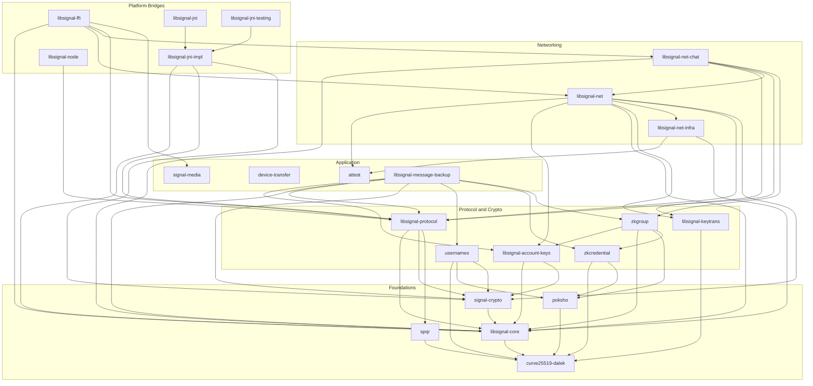

# libsignal Rust Workspace Architecture

libsignal is Signal's core cryptographic and protocol library.
A single Rust workspace implements all logic; platform-specific bridges expose it to Swift (via C FFI), Java/Android (via JNI), and Node.js/TypeScript (via Neon).

This document covers the **23 workspace member crates**, their purposes, and how they depend on each other.

## Reproducing the diagrams

All diagrams were generated from the workspace root.

**Workspace dependency graph (SVG):**

```bash
cargo depgraph --workspace-only | dot -Tsvg > docs/workspace-deps.svg
```

Requires `cargo-depgraph` (`cargo install cargo-depgraph`) and Graphviz (`apt install graphviz` / `brew install graphviz`).
The SVG includes non-member local crates (libsignal-bridge, libsignal-svrb, etc.) that live in the repo but aren't declared workspace members.

**Workspace dependency tree (text):**

```bash
cargo tree --workspace -e no-dev --depth 1
```

**Per-crate workspace deps only:**

```bash
cargo tree -p <crate-name> -e no-dev --depth 1 2>/dev/null | grep '(/'
```

**Module structure of a single crate:**

```bash
cargo modules structure -p <crate-name>
```

Requires `cargo-modules` (`cargo install cargo-modules`).

**Layered dependency diagram (SVG from Mermaid):**

The Mermaid flowchart in this doc was hand-curated: the edges come from `cargo depgraph --workspace-only` and the layer groupings were assigned manually based on each crate's role. To dump the raw edge list used as input:

```bash
cargo depgraph --workspace-only | python3 -c "
import sys, re
lines = sys.stdin.read()
nodes = {}
for m in re.finditer(r'(\d+) \[ label = \"([^\"]+)\"', lines):
    nodes[m.group(1)] = m.group(2)
for m in re.finditer(r'(\d+) -> (\d+) \[', lines):
    print(f'{nodes[m.group(1)]} --> {nodes[m.group(2)]}')
" | sort
```

To render the Mermaid source to SVG:

```bash
# Extract the mermaid block from this file, then render:
python3 -c "
import re
with open('docs/ARCHITECTURE.md') as f:
    text = f.read()
m = re.search(r'\x60\x60\x60mermaid\n(.*?)\n\x60\x60\x60', text, re.DOTALL)
with open('docs/dependency-graph.mmd', 'w') as out:
    out.write(m.group(1))
"
echo '{"args":["--no-sandbox"]}' > /tmp/puppeteer-config.json
mmdc -i docs/dependency-graph.mmd -o docs/dependency-graph.svg -b white -p /tmp/puppeteer-config.json
```

Requires `@mermaid-js/mermaid-cli` (`npm install -g @mermaid-js/mermaid-cli`).

## Dependency graph



[Interactive version with zoom/pan](dependency-graph.html) (open in a browser) |
[Full flat graph including non-member crates (cargo-depgraph)](workspace-deps.svg)

**Note:** Some crates (`device-transfer`, `signal-media`, and partly `attest`) appear as islands with no edges in the members-only graph. This is because their only consumers are non-member bridge shared crates (`libsignal-bridge`, `libsignal-bridge-types` in `rust/bridge/shared/`), which act as the aggregation layer. The workspace-member bridge crates (`libsignal-ffi`, `libsignal-jni-impl`, `libsignal-node`) depend on that aggregator rather than on these standalone crates directly. The [full flat graph](workspace-deps.svg) shows these connections.

Below is the Mermaid source for the layered diagram above. Arrows mean "depends on".



## Reading the graph

The diagram is organized into five layers. Dependencies flow downward: higher layers
depend on lower layers, never the reverse.

**Foundations** (bottom of the stack) --
`curve25519-dalek` provides elliptic curve arithmetic and is the most depended-on
crate in the workspace. `spqr` adds post-quantum key exchange. `libsignal-core`
wraps curve keys into Signal-specific identity types (`ServiceId`, `ProtocolAddress`)
used everywhere above. `signal-crypto` layers symmetric encryption (AES, HPKE) on
top of core. `poksho` provides zero-knowledge proof machinery (Stateful Hash Object)
used by the credential and username systems.

**Protocol and Crypto** --
`libsignal-protocol` is the heart: it combines core types, symmetric crypto, and
post-quantum key exchange (`spqr`) to implement Signal's end-to-end encryption
(X3DH, Double Ratchet, Sealed Sender). The ZK stack runs in parallel:
`zkcredential` builds anonymous credentials from `poksho` + `curve25519-dalek`,
`zkgroup` uses those credentials for group operations (profile keys, auth tokens,
send endorsements), and `usernames` uses `poksho` for zero-knowledge username proofs.
`libsignal-account-keys` derives backup and PIN keys from entropy pools.
`libsignal-keytrans` verifies key transparency logs independently.

**Application** --
`libsignal-message-backup` is the most connected crate at this layer -- it pulls in
protocol, crypto, accounts, usernames, and ZK credentials to validate backup files.
`attest`, `device-transfer`, and `signal-media` are standalone: they handle enclave
attestation, device migration, and media sanitization respectively, with no dependencies
on other workspace members (they connect to the rest through the non-member bridge
shared layer).

**Networking** --
`libsignal-net-infra` provides the transport layer (TLS, WebSocket, DNS, Noise pipes)
and uses `attest` for enclave handshakes. `libsignal-net` builds on it to implement
Signal service clients (CDSI contact discovery, SVR secure value recovery, key
transparency). `libsignal-net-chat` sits on top for chat-specific concerns
(authenticated WebSocket channels, registration).

**Platform Bridges** (top of the stack) --
`libsignal-ffi`, `libsignal-jni`/`libsignal-jni-impl`, and `libsignal-node` are
thin entry points. They depend on the non-member `libsignal-bridge` crate
(`rust/bridge/shared/`) which aggregates nearly every core crate and exposes it
through `#[bridge_fn]` macros. A platform call enters a bridge, delegates to the
Rust core, and returns. The bridges never contain business logic.

### Information flow for a 1:1 message send

```
Platform app (Swift / Java / TypeScript)
  │
  ▼
Bridge crate (libsignal-ffi / libsignal-jni / libsignal-node)
  │  via libsignal-bridge (non-member aggregator)
  ▼
libsignal-protocol          ← encrypts with Double Ratchet + Sealed Sender
  ├─► signal-crypto         ← AES-CBC for message body, HMAC for MAC
  ├─► libsignal-core        ← ProtocolAddress, identity key types
  └─► spqr                  ← post-quantum ratchet step (ML-KEM)
        └─► curve25519-dalek ← scalar multiplication, Ristretto ops
  │
  ▼
libsignal-net-chat          ← opens authenticated WebSocket
  └─► libsignal-net         ← routes to chat server endpoint
        └─► libsignal-net-infra ← TLS, DNS, connection failover
```

### Information flow for a group send

```
Platform app
  │
  ▼
Bridge crate
  │
  ├─► zkgroup               ← obtains GroupSendEndorsement (anonymous credential)
  │     ├─► zkcredential    ← endorsement issuance/presentation
  │     └─► poksho          ← zero-knowledge proof
  │
  ├─► libsignal-protocol    ← group_encrypt() with sender key
  │     └─► (same crypto stack as 1:1)
  │
  ▼
libsignal-net-chat          ← sends over authenticated WebSocket
```

### Information flow for backup restore

```
Platform app
  │
  ▼
Bridge crate
  │
  ▼
libsignal-message-backup
  ├─► libsignal-account-keys ← derives backup HMAC + AES keys from entropy pool
  │     └─► signal-crypto    ← HKDF key derivation
  ├─► signal-crypto          ← AES-256-CBC decryption of frames
  ├─► libsignal-protocol     ← validates session/identity data in backup
  ├─► zkgroup + zkcredential ← validates group credentials in backup
  └─► usernames              ← validates username proofs in backup
```

## Crate reference

### Foundations

These are the lowest-level crates with no (or minimal) workspace dependencies.

**curve25519-dalek** (`curve25519-dalek/`) --
Curve25519 and Ristretto255 group operations. This is a [Beneficial AI Foundation fork](https://github.com/nicola-2/curve25519-dalek-signal) with Verus formal verification of field arithmetic. Patched into the workspace via `[patch.crates-io]`.
Workspace deps: none.

**spqr** (`spqr/`) --
Sparse Post-Quantum Ratchet. Implements Signal's ML-KEM Braid Protocol for post-quantum key agreement. Includes formal verification models in hax/F* and ProVerif.
Workspace deps: curve25519-dalek.

**libsignal-core** (`rust/core/`) --
Shared identity and address types used throughout the codebase: `ServiceId` (with `Aci`/`Pni` variants), `ProtocolAddress`, `E164` phone numbers, and Curve25519 key wrappers.
Workspace deps: curve25519-dalek.

**signal-crypto** (`rust/crypto/`) --
Symmetric cryptography primitives: AES-CBC, AES-CTR, AES-GCM, HPKE, and hashing utilities.
Workspace deps: libsignal-core.

**poksho** (`rust/poksho/`) --
**P**roof **O**f **K**nowledge using a **S**tateful **H**ash **O**bject. Provides Schnorr-style zero-knowledge proofs and the SHO abstraction (HMAC-SHA256 and SHA256 backends).
Workspace deps: curve25519-dalek.

### Protocol and Crypto

Higher-level cryptographic protocols built on the foundations.

**libsignal-protocol** (`rust/protocol/`) --
The Signal Protocol implementation: [X3DH](https://signal.org/docs/specifications/x3dh/) key agreement, [Double Ratchet](https://signal.org/docs/specifications/doubleratchet/) messaging, sealed sender, group cipher (Sender Key), session management, and incremental MAC.
Workspace deps: libsignal-core, signal-crypto, spqr.

**libsignal-account-keys** (`rust/account-keys/`) --
Operations on account-associated keys: backup key derivation, PIN-based key stretching (Argon2), and local/SVR key management.
Workspace deps: libsignal-core, signal-crypto.

**zkcredential** (`rust/zkcredential/`) --
Framework for building attribute-based anonymous credentials (ABCs). Supports issuance, presentation, and verification of credentials with blinded attributes and endorsements.
Workspace deps: curve25519-dalek, poksho.

**zkgroup** (`rust/zkgroup/`) --
Zero-knowledge group operations built on zkcredential: profile key credentials, auth credentials, expiring member credentials, group send endorsements, and receipt credentials.
Workspace deps: libsignal-account-keys, libsignal-core, poksho, zkcredential.

**usernames** (`rust/usernames/`) --
Zero-knowledge username system: proof generation/verification for username ownership, and encrypted username links for sharing.
Workspace deps: curve25519-dalek, poksho, signal-crypto.

**libsignal-keytrans** (`rust/keytrans/`) --
Key transparency: verifying key distribution via VRF (Verifiable Random Functions) and auditable transparency logs.
Workspace deps: curve25519-dalek.

### Application

Domain-specific functionality that consumes the protocol and crypto layers.

**attest** (`rust/attest/`) --
Enclave attestation for Signal's server-side secure enclaves: SGX (DCAP), Nitro, CDS2 (Contact Discovery Service), SVR2/SVR3 (Secure Value Recovery), and HSM enclaves. No workspace deps (uses only external crates like `boring`, `snow`).

**device-transfer** (`rust/device-transfer/`) --
Device-to-device transfer support: RSA key generation and self-signed certificate creation for secure device migration. No workspace deps.

**signal-media** (`rust/media/`) --
Media sanitization: strips metadata from MP4 video and WebP images to prevent information leakage. No workspace deps.

**libsignal-message-backup** (`rust/message-backup/`) --
Reading, validating, and exporting Signal message backup files. Handles the encrypted protobuf-based backup format, with a model-based validation pipeline.
Workspace deps: libsignal-account-keys, libsignal-core, libsignal-protocol, signal-crypto, usernames, zkcredential, zkgroup.

### Networking

Client-side networking for talking to Signal servers.

**libsignal-net-infra** (`rust/net/infra/`) --
Low-level network infrastructure: TLS (via boring and rustls), WebSocket framing, DNS resolution, connection routing/failover, Noise protocol pipes, and timeout management.
Workspace deps: attest, libsignal-core.

**libsignal-net** (`rust/net/`) --
High-level Signal service client: Contact Discovery (CDSI), Secure Value Recovery (SVR), enclave connections, key transparency lookups, and chat service routing.
Workspace deps: attest, libsignal-account-keys, libsignal-core, libsignal-keytrans, libsignal-net-infra, libsignal-protocol, signal-crypto.

**libsignal-net-chat** (`rust/net/chat/`) --
Chat-specific networking: authenticated and unauthenticated WebSocket channels, and the registration API.
Workspace deps: libsignal-core, libsignal-keytrans, libsignal-net, libsignal-protocol, zkgroup.

### Platform Bridges

These crates expose the Rust implementation to other languages. They all depend (directly or through `libsignal-bridge`, a non-member crate) on essentially every core crate above.

**libsignal-ffi** (`rust/bridge/ffi/`) --
C ABI shared library for Swift/iOS. Functions are `extern "C"` with `#[no_mangle]`, discovered via cbindgen.
Direct workspace deps: libsignal-core, libsignal-net, libsignal-net-chat, libsignal-protocol, signal-media.

**libsignal-jni** (`rust/bridge/jni/`) --
JNI shared library for Java/Android. Thin wrapper re-exporting from libsignal-jni-impl.
Direct workspace deps: libsignal-jni-impl.

**libsignal-jni-impl** (`rust/bridge/jni/impl/`) --
JNI implementation: `Java_*` native method exports.
Direct workspace deps: libsignal-core, libsignal-protocol, signal-crypto.

**libsignal-jni-testing** (`rust/bridge/jni/testing/`) --
JNI test helpers: imports bridged test functions for linker inclusion.
Direct workspace deps: libsignal-jni-impl.

**libsignal-node** (`rust/bridge/node/`) --
Neon (N-API) bridge for Node.js/TypeScript. Also includes minidump processing for crash diagnostics.
Direct workspace deps: libsignal-protocol.

## Non-member local crates

These crates live in the repo and are used by workspace members, but are not declared in `[workspace] members`. They appear in `cargo depgraph` and `cargo tree` output.

| Crate | Path | Role |
|---|---|---|
| libsignal-bridge | `rust/bridge/shared/` | Shared bridge logic: `#[bridge_fn]` / `#[bridge_io]` function definitions callable from all three platforms |
| libsignal-bridge-macros | `rust/bridge/shared/macros/` | Proc-macro crate for `#[bridge_fn]` and `#[bridge_io]` |
| libsignal-bridge-types | `rust/bridge/shared/types/` | Type conversion traits and runtime utilities for each target language |
| libsignal-bridge-testing | `rust/bridge/shared/testing/` | Test helpers shared across bridge implementations |
| libsignal-svrb | `rust/svrb/` | Secure Value Recovery protocol Backup format |
| libsignal-cli-utils | `rust/cli-utils/` | CLI argument parsing helpers (hex, base64, ServiceId) |
| libsignal-net-grpc | `rust/net/grpc/` | gRPC client definitions (tonic/prost) |
| signal-neon-futures | `rust/bridge/node/futures/` | Async runtime bridging between Tokio and Neon |
| libsignal-message-backup-macros | `rust/message-backup/macros/` | Proc-macro helpers for backup model types |

